# PieckPick Frontend

준비된 인프라에 애플리케이션을 배포하고, 진행 상황·자원 구성·로그·지표를 확인하는 **React + TypeScript + Vite 관리 콘솔**입니다. 서비스 이름은 **PieckPick**, 저장소 이름은 기존 `Freesia-Frontend`를 유지합니다.

[운영 콘솔](https://sbh.howon.me/) · [백엔드](https://github.com/softbank-hackathon-2026/Freesia-backend) · [앱 배포 워크플로](https://github.com/softbank-hackathon-2026/workload-deploy) · [플랫폼 인프라](https://github.com/softbank-hackathon-2026/platform-terraform)

## 빠른 시작

**Node.js 24 이상과 npm**이 필요합니다. API 화면을 사용하려면 [백엔드 실행 안내](https://github.com/softbank-hackathon-2026/Freesia-backend#readme)에 따라 백엔드를 먼저 실행합니다.

```sh
npm ci
npm run dev
```

| 주소 | 데이터 소스 |
|---|---|
| [http://localhost:5173/](http://localhost:5173/) | 기본 API 모드. 실행 중인 백엔드에 연결 |
| [http://localhost:5173/?source=demo](http://localhost:5173/?source=demo) | 명시적인 데모 경로. 브라우저 `localStorage`의 샘플 데이터 |

API 오류가 발생해도 데모 데이터로 자동 대체하지 않습니다. Vite는 5173 포트를 고정 사용하므로 이미 개발 서버가 실행 중이면 기존 서버를 사용하거나 포트를 비운 뒤 시작합니다.

### API 주소 설정

기본값은 `/api`이며, 개발 서버는 경로를 그대로 유지하여 `http://localhost:8000/api/...`로 전달합니다. 별도 환경변수 설정 없이 로컬 백엔드와 연결할 수 있습니다.

주소를 바꾸려면 [`.env.example`](.env.example)을 `.env.local`로 복사하고 개발 서버를 재시작합니다.

```dotenv
VITE_API_BASE_URL=/api
```

다른 서버에 직접 연결할 때는 `https://backend.example.com/api`처럼 **`/api`를 포함한 주소**를 지정하고 백엔드 CORS를 허용합니다. `VITE_` 변수는 브라우저 빌드에 포함되므로 비밀키를 넣지 않습니다. 배포된 정적 파일에는 Vite 개발 프록시가 없으며 운영 환경에서는 CloudFront가 같은 도메인의 `/api`를 백엔드로 전달합니다.

## 화면과 앱 배포 흐름

| 메뉴 | 주요 기능 |
|---|---|
| 인프라 | Infra Space 목록·상세 조회. 이름 입력 → AI 대화 → Terraform 검토·Apply의 생성 흐름은 데모 |
| 통합 | 기존 공개 GitHub 저장소 URL 등록·조회·등록 해제. 새 등록의 브랜치는 `main` |
| 애플리케이션 | 앱 생성, 분석·실행 환경 선택·구성안 검토, 배포·재배포·내리기·삭제, 자원 트리, 로그·모니터링 |

**통합에서 저장소를 등록한 뒤**, 앱 이름·등록된 저장소·Infra Space를 선택하여 앱을 만듭니다. 앱 생성 화면에서는 저장소 URL을 다시 입력하지 않습니다. 인프라를 선택하지 않는 샌드박스 경로는 서버에 준비된 기본 Infra Space를 사용합니다. GitHub 로그인·OAuth 연결이나 새 GitHub 저장소 생성 기능은 없습니다.

앱 상세의 **개요**는 다음 5단계입니다.

1. **코드 분석** — 서버가 반환한 요구사항·근거·실행 환경 후보를 확인합니다.
2. **실행 환경 선택** — 추천 후보 중 배포 가능한 환경을 직접 선택합니다. 추천 여부와 배포 지원 여부는 구분합니다.
3. **구성안 검토** — 템플릿과 설정값을 확인하고 배포를 요청합니다.
4. **배포 진행** — SSE(Server-Sent Events)로 진행 단계·성공/실패 상태·소요 시간을 확인합니다.
5. **전체 구성** — 백엔드가 제공한 배포 자원을 트리로 확인합니다.

**로그와 모니터링은 별도 탭**에서 확인합니다. 4단계는 배포 진행, 5단계는 자원 구성에 집중합니다. 트리는 보고된 자원을 그룹으로 보여주는 화면이며 Terraform 의존성 그래프나 자원 편집기가 아닙니다.

새 버전 재배포는 성공한 배포의 설정과 대상 커밋을 조회하고 확인한 뒤 요청합니다. 설정을 바꾸려면 별도의 재분석 흐름을 사용합니다. 앱 내리기는 자원을 정리하는 요청이며, 앱 삭제는 서버에서 앱 기록을 숨기는 별도 동작입니다. 실행 가능 여부와 실패 이유는 서버 응답을 따릅니다.

## 전체 구조



[전체 구조 상세 다이어그램](docs/architecture/system.html) · [모니터링 상세 다이어그램](docs/architecture/monitoring.html)

위 그림은 기존 **archify** 다이어그램에서 내보낸 이미지입니다. 상세 HTML은 GitHub에서 소스로 표시됩니다. 저장소를 clone하거나 파일을 다운로드한 뒤 **브라우저로 열면** 확대·검색·노드 상세 탐색을 사용할 수 있습니다.

프론트엔드는 FastAPI에 요청하고 서버 결과를 표시합니다. 백엔드는 GitHub Actions에 배포를 요청하며, 워크플로가 AWS에서는 Terraform, 온프레미스에서는 Ansible로 작업하고 결과를 백엔드에 전달합니다. 프론트엔드가 AWS 자격증명을 갖거나 Terraform을 직접 실행하지 않습니다. 앱 배포 구성은 템플릿과 설정값을 사용하며, AI가 사용자 저장소에 Terraform 코드를 commit/push하는 흐름은 아닙니다.

## 로그와 모니터링



| 실행 환경 | 화면에 표시하는 지표 | 앱 로그 |
|---|---|---|
| ECS Fargate | CPU·메모리·평균 응답 시간·요청 수·앱 5xx 오류 수 | 컨테이너가 CloudWatch로 보낸 로그 |
| Lambda | 평균 처리 시간·호출 수·함수 오류 수 | 함수의 CloudWatch 로그 |
| EC2 | CPU | Docker가 CloudWatch로 보낸 앱 로그 |

EC2 메모리 지표는 현재 화면에서 제공하지 않습니다. 온프레미스·다른 공급자의 아이콘 표시는 해당 환경의 지표 수집 지원을 뜻하지 않습니다. 알람과 트레이스는 현재 구현 범위에 포함되지 않습니다.

- **조회:** 로그·모니터링 탭을 열 때 즉시 요청하고, 요청이 끝난 뒤 약 15초 후 다시 조회합니다. 수동 새로고침도 지원합니다. 지표는 60초 단위 집계의 최신 측정값을 표시하며, 새로고침 시각과 측정 시각은 다를 수 있습니다.
- **로그:** 최대 100줄을 받아 메시지 검색·강조, 자동 갱신 일시정지/재개, TXT 다운로드를 제공합니다. TXT는 검색 결과와 관계없이 수신한 전체 로그 스냅샷을 저장합니다. UTF-8 BOM·CRLF를 사용하며 화면 시간은 브라우저 현지 시간, TXT 시간은 UTC입니다.
- **상태:** `ok` / `waiting` / `not_deployed` / `unsupported` / `error`를 구분합니다. 측정값이 없으면 `—`로 표시하며 실제 `0`과 구분합니다. 배포 완료나 데이터 수신만으로 앱 정상 상태를 판단하지 않습니다.

연결 경로는 `GET /api/app-spaces/{id}/metrics`와 `GET /api/app-spaces/{id}/logs?limit=100`입니다. 실제 데이터 수집은 배포 템플릿·로그 설정·백엔드의 AWS 읽기 권한에 따릅니다. API 응답 계약과 변경 이력은 [docs/contracts.md](docs/contracts.md)를 확인하세요.

## 코드 위치

```text
src/
├─ App.tsx                         # 공통 레이아웃과 화면 진입점
├─ components/Applications.tsx     # 앱 분석·배포·재배포·내리기 흐름
├─ components/DeploymentResources.tsx # 자원 트리
├─ components/ApplicationLogs.tsx  # 로그 조회·검색·다운로드
├─ components/ApplicationMetrics.tsx # 실행 환경별 지표
├─ components/GitHubIntegration.tsx # 저장소 등록
├─ components/InfraBuilder.tsx     # 인프라 설계 데모
└─ lib/api.ts                      # API 어댑터·응답 검증·SSE 연결
```

## 검증

| 명령 | 확인 범위 |
|---|---|
| `npm run check` | TypeScript → ESLint → Node 테스트 → Vite 빌드. 첫 실패 시 종료 |
| `npm run test:e2e` | 설치된 Chrome과 로컬 Vite로 데모·모의 API UI 검사. 캡처는 `artifacts/`에 저장 |
| `npm run build` | 타입 검사 후 배포할 정적 파일을 `dist/`에 생성 |

브라우저 검사는 `CHROME_PATH`로 Chrome 경로를 지정할 수 있으며 브라우저를 다운로드하지 않습니다. 기본 5173 포트가 사용 중이면 개발 서버를 종료하거나 `BROWSER_CHECK_PORT`로 검사 포트를 지정합니다. 자동 검사는 실제 AI 호출·AWS 배포·운영 모니터링의 성공을 증명하지 않습니다.

## 프론트엔드 배포

관리 콘솔 자체는 **S3 + CloudFront**에 배포합니다. 고객 앱을 배포하는 화면 기능과 별개의 워크플로입니다.

1. GitHub **Actions → Deploy → Run workflow**에서 병합된 `main`을 선택합니다.
2. 검사·빌드 → S3 업로드 → CloudFront 캐시 갱신 → 배포 HTML 확인이 완료되는지 봅니다.
3. [운영 콘솔](https://sbh.howon.me/)에서 화면과 API 연결을 확인합니다.

[Deploy 워크플로](.github/workflows/deploy.yml)는 **수동 실행 전용**입니다. main에 머지하는 것만으로 배포되지 않습니다. JS·CSS를 먼저 업로드하고 `index.html`을 마지막에 올리며, 이전 페이지가 참조하는 파일을 보존하기 위해 `--delete`를 사용하지 않습니다. 필요한 AWS 자격증명은 GitHub Secrets에서 주입합니다. 마지막 자동 검사는 배포 HTML과 빌드 결과의 일치 확인입니다.

## 상세 문서

- [API 계약·변경 이력](docs/contracts.md)
- [개발 계획·검증·인수인계](docs/plans/README.md)
- [전체 구조 HTML](docs/architecture/system.html) · [모니터링 HTML](docs/architecture/monitoring.html)

README 기능 안내는 **2026-10-04의 main `0dba04e`**를 기준으로 정리했습니다. archify 그림은 같은 날 검증된 구조 설명을 재사용합니다. 실제 운영 배포 버전이나 AWS 자원 상태를 조회한 결과는 아닙니다. 개발 기록에는 과거 제안·구현 상태가 보존되어 있으므로 최신 후속 기록을 함께 확인하세요.
