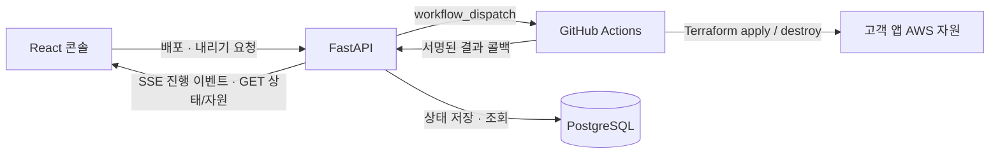

# Freesia Frontend

Freesia는 준비된 인프라에 애플리케이션을 배포하고, 진행 상황과 자원 상태를 확인하는 플랫폼입니다. 이 저장소는 **React + TypeScript + Vite 기반 관리 콘솔**을 담당합니다.

- [운영 콘솔 — API 모드](https://sbh.howon.me/?source=api)
- 관련 저장소: [백엔드](https://github.com/softbank-hackathon-2026/Freesia-backend) · [앱 배포 워크플로](https://github.com/softbank-hackathon-2026/workload-deploy) · [플랫폼 인프라](https://github.com/softbank-hackathon-2026/platform-terraform)

## 1. 화면과 사용 흐름

| 메뉴 | 하는 일 |
|---|---|
| 인프라 | 앱이 사용할 Infra Space 조회. 인프라 생성·AI 질의응답·Terraform Apply는 현재 데모 흐름 |
| 애플리케이션 | 앱 생성, 코드 분석 결과·실행 환경 선택, 구성안 검토, 배포, 자원 트리, 앱 내리기 |
| 통합 | 기존 공개 GitHub Repository URL 등록·조회·등록 해제. 새 등록은 `main` 브랜치 사용 |

**앱 배포 순서**

1. **통합**에서 공개 GitHub 저장소 URL을 등록합니다. GitHub 로그인·OAuth 연결이나 새 저장소 생성 과정은 없습니다.
2. **애플리케이션 생성**에서 앱 이름, 준비된 Infra Space, 등록한 Repository를 선택합니다. 이 화면에 URL을 다시 입력하지 않습니다.
3. 분석을 요청하고 서버가 반환한 요구사항·근거·실행 환경 후보를 확인합니다. 추천 여부와 현재 배포 지원 여부는 별개입니다.
4. 실행 환경을 직접 선택하고 **템플릿 + 설정값 구성안**을 검토합니다. 구성안이 하나면 바로 검토 화면으로 이동하며, `container_port` 등 서버가 제공한 값을 확인합니다.
5. 배포 버튼을 누르면 백엔드가 배포 워크플로를 실행합니다. 진행 단계·자원 트리·결과를 확인하고 성공 시 앱 주소를 엽니다.
6. 사용을 마친 앱은 상세 화면의 **내리기**에서 확인 후 종료합니다. 완료되면 앱 주소가 숨겨집니다. 앱 기록은 남으며 다시 배포할 수 있습니다.



프론트는 AWS나 Terraform을 직접 실행하지 않습니다. 자원 트리는 워크플로가 보고하고 백엔드 DB에 저장한 상태를 표시합니다. 현재 앱 배포는 템플릿과 설정값을 사용하며, AI가 Terraform 코드를 사용자 저장소에 commit/push하는 흐름이 아닙니다.

## 2. 로컬 실행

필수 환경: **Node.js 24 이상**, npm. API 모드는 별도로 실행한 [Freesia 백엔드](https://github.com/softbank-hackathon-2026/Freesia-backend#readme)가 필요합니다.

```sh
npm ci
npm run dev
```

| 접속 주소 | 데이터와 동작 |
|---|---|
| [localhost:5173](http://localhost:5173/) 또는 [데모 모드](http://localhost:5173/?source=demo) | 기본 모드. 브라우저 `localStorage`에 저장하는 샘플 데이터이며 실제 클라우드 작업을 하지 않음 |
| [API 모드](http://localhost:5173/?source=api) | 백엔드가 반환한 데이터를 사용. 실제 배포 여부는 연결한 백엔드의 설정에 따름 |

API 오류가 발생해도 데모 데이터로 자동 대체하지 않습니다. 두 모드의 데이터는 별개입니다.

### 백엔드 연결

기본 설정은 별도 환경변수 없이 다음 경로를 사용합니다.

```text
브라우저 /api/... → Vite 개발 프록시 → http://localhost:8000/api/...
```

주소를 바꾸려면 [`.env.example`](.env.example)을 `.env.local`로 복사하고 설정한 뒤 개발 서버를 재시작합니다.

```dotenv
# 로컬 백엔드와 개발 프록시 사용 (기본값)
VITE_API_BASE_URL=/api
```

다른 백엔드에 직접 연결하려면 `VITE_API_BASE_URL=https://backend.example.com/api`처럼 **`/api`까지 포함**합니다. 이 경우 백엔드에서 프론트 주소에 대한 CORS 허용이 필요합니다. `VITE_` 환경변수는 브라우저 빌드에 포함되므로 비밀키를 넣지 않습니다.

배포 빌드에는 Vite 개발 프록시가 없습니다. 현재 운영 환경은 같은 도메인의 `/api` 요청을 CloudFront에서 백엔드로 전달합니다.

### 자주 확인할 사항

- **서버 데이터 대신 샘플이 보임:** URL의 `source=api` 여부를 확인합니다.
- **API 연결 실패:** 백엔드 실행 상태, 8000 포트, `VITE_API_BASE_URL`의 `/api`, 직접 연결 시 CORS를 확인합니다.
- **트리가 비어 있음:** 해당 배포의 자원 API가 목록을 반환하는지 확인합니다. 빈 목록을 임의의 샘플 자원으로 채우지 않습니다.
- **5173 포트를 사용할 수 없음:** 기존 개발 서버를 사용하거나 종료한 뒤 재실행합니다. Vite는 `strictPort`를 사용합니다.

## 3. 현재 구현 범위

아래는 **2026-10-02 기준**입니다. API에 연결되어 있다는 사실만으로 응답이 실제 AI 분석이거나 클라우드 실행 결과라고 판단하지 않습니다.

| 기능 | 현재 상태 |
|---|---|
| 공개 Repository 등록·조회·해제, 앱 생성·조회 | 백엔드 API 연결. 저장소 등록은 URL 저장이며 실제 공개 여부·접근 권한·브랜치 존재를 보증하지 않음 |
| Infra Space 목록·상세 | 백엔드 API 연결. 인프라 생성·AI 대화·Apply는 데모이며 실제 네트워크 생성 API는 미연결 |
| 앱 분석·구성안 | 서버 결과 표시·비동기 완료 대기 구현. 분석은 기본 2초 간격·최대 150초 재조회. 실제 AI 사용 여부는 백엔드 모델 설정에 따름 |
| 실행 환경 선택 | 추천 후보와 `deployable_computes`를 구분. 미지원 후보는 준비 중으로 표시. 현재 백엔드 배포 대상은 ECS Fargate |
| 앱 배포·진행 | 구성안의 `plan_id`를 포함해 배포 요청. SSE로 진행 이벤트 수신, 연결 복구·실패 표시 지원 |
| 새 버전 재배포 | 앱 상세의 별도 확인창. 데모는 이전 성공 설정을 그대로 재사용하며, API 모드는 최신 커밋·성공 설정 재사용 계약이 없어 실행 대기. 기존 분석→구성안→배포는 별도 흐름 |
| 자원 트리 | 자원 조회 API의 상태로 표시하며 내린 자원은 회색 `삭제됨`으로 표시. 서버/저장소/연결 등의 화면상 그룹이며 Terraform 의존성 그래프나 자원 편집기가 아님 |
| 앱 내리기 | `requested` 동안 3초 간격 조회·새로고침 후 재개. 성공 시 주소 숨김, 실패 이유·재시도 표시, 진행 중 배포·중복 내리기 차단 |
| 앱 삭제 | 목록에서 선택하거나 앱 상세에서 현재 앱을 확인한 후 서버에서 숨김. 기록은 유지하며, AWS 자원이 남았거나 배포·내리기 중이면 서버가 거절한 이유 표시 |
| 앱 로그·모니터링 | 화면은 있으나 실제 조회 API 미연결. API 모드에서는 연동 대기를 표시 |

**팀원 공유 검증 결과:** 2026-10-02 `sample-shop` 퍼블릭 환경에서 운영 콘솔의 배포 → 진행 단계·자원 트리 → 앱 접속, 내리기 → AWS 자원 삭제 → 완료 콜백 → 주소 제거가 성공했다고 공유받았습니다. 각각 약 4분이었으며, 다른 앱·프라이빗 환경·실패/재시도·실제 AI 분석·모니터링까지 검증했다는 의미는 아닙니다.

## 4. 검증과 프론트엔드 배포

### 로컬 검증

```sh
npm run check
npm run test:e2e
```

| 명령 | 확인 범위 |
|---|---|
| `npm run check` | TypeScript → ESLint → Node 테스트 → Vite 빌드. 첫 실패 시 종료 |
| `npm run test:e2e` | 로컬 Vite와 Chrome으로 데모·모의 API 응답을 사용한 UI 회귀 검사, 데스크톱·모바일 캡처를 `artifacts/`에 저장 |
| `npm run build` | 배포할 정적 파일을 `dist/`에 생성 |

브라우저 검사는 설치된 Chrome을 사용하며 `CHROME_PATH`로 실행 파일 경로를 지정할 수 있습니다. 브라우저를 추가 다운로드하지 않습니다. 5173 포트를 사용하므로 실행 중인 개발 서버는 먼저 종료합니다. 프록시 테스트는 로컬 HTTP 테스트 서버로 GET·POST·SSE 경로 전달을 확인합니다. 이 자동 검사들은 실제 AI 호출이나 AWS 배포 성공을 증명하지 않습니다.

### 관리 콘솔 자체 배포

이 절은 **Freesia 프론트 파일을 배포하는 방법**입니다. 화면에서 고객 앱을 배포하는 기능은 1절의 흐름을 따릅니다.

1. GitHub 저장소의 **Actions → Deploy → Run workflow**를 엽니다.
2. 배포할 브랜치를 확인합니다. 운영 반영은 병합된 `main`을 선택해 수동 실행합니다.
3. 워크플로의 완료 결과와 [운영 콘솔](https://sbh.howon.me/?source=api)을 확인합니다.

현재 [배포 워크플로](.github/workflows/deploy.yml)는 `workflow_dispatch` 전용이므로 **main에 머지해도 자동 배포되지 않습니다.**

```text
npm ci → npm run check → dist/를 S3에 업로드
→ CloudFront 캐시 갱신 완료 대기 → 배포된 index.html과 빌드 결과 비교
```

JS·CSS를 먼저 올리고 `index.html`을 마지막에 올립니다. 기존 페이지가 참조하는 파일을 보존하도록 `--delete`를 사용하지 않습니다. 실행에는 저장소에 설정된 AWS 자격증명과 대상 S3·CloudFront 권한이 필요합니다. 마지막 검사는 HTML 일치 확인이며 버튼·실제 앱 배포까지 검사하지 않습니다.

### 코드와 상세 문서

- [API 어댑터](src/lib/api.ts) · [앱 배포·내리기 화면](src/components/Applications.tsx) · [자원 트리](src/components/DeploymentResources.tsx)
- [API 계약과 변경 이력](docs/contracts.md)
- [개발 계획·검증 기록](docs/plans/README.md)

상세 문서에는 초기 제안과 과거 구현 상태도 보존되어 있습니다. 현재 기능 안내는 위 구현 범위를 보고, 변경 배경은 문서의 후속 정정·최신 날짜 기록을 함께 확인하세요.
